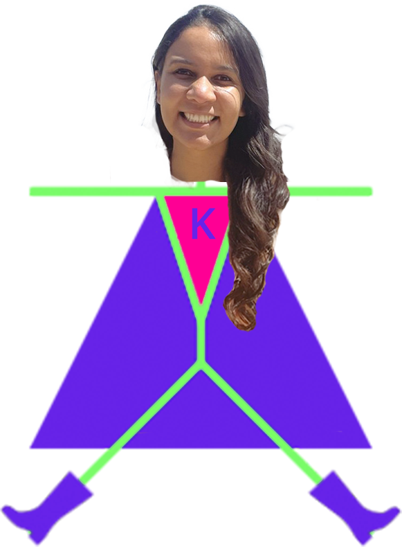

# General Information

[Codaisseur](https://codaisseur.com/) is an educational institute based in the Netherlands that trains people who are aspiring to work in the tech industry.

During class 51 of [Codaisseur's Full Stack JavaScript bootcamp](https://codaisseur.com/courses/academy/), students were divided into groups and each group was asked to deliver a project themed as **Entertainment**.

Our group consisted of four people (in alphabetic order):

- [Anjad Qusaibaty](https://github.com/Anjad-Qusaibaty).
- [Gaurangi Mane](https://github.com/GaurangiM).
- [Martijn van Veen](https://github.com/Martijncvv).
- [Rakan Douli](https://github.com/Rairakzak).

The group decided to build an arcade with two mini games where the main protagonists are our teachers [Karla Evelize](https://www.linkedin.com/in/karla-evelize/) and [Matias Garcia](https://www.linkedin.com/in/matias-garcia-79b6aa108/).

## Game 1: Super Mat

### Description

In SuperMat game, the aim is to guide our cool teacher/sensei Super Mat up a never-ending series of lectures without falling. Mat can get a a high jump boost when he drinks mate his favorite drink. There are also Meeting obstacles (Google meet logo) that SuperMat must avoid. There is no definitive end to the game, but the end for each game session happens when SuperMat falls to the bottom.

### Game Goal

The main aim of this game is to get as many points as possible by clearing lectures (programming stacks). During Super Mat’s flight, he can pick up his favorite drink, mate, which gives him a flight boost. Meetings are SuperMate’s kryptonite. If he lands at a meeting (Google Meet logo) his flight ability gets nerfed and he loses points.

### Contorls

Super Mat moves left and right with the left and right arrows, and the middle arrow helps stabilizing him in the middle.

## Game 2: Wonder Karla

### Description

As a platform game, the player runs and jumps across platforms and atop enemies in coding themed levels. The game includes a multitude of power-ups and items that give Karla special powers such as size-changing into both giant and miniature sizes.

### Game Goal

The main aim of this game is to get as many points as possible by collecting items, destroying enemies and beating levels. There are various enemies WonderKarla should avoid; Red React and Evil Redux. If she gets hit by an enemy, the game is over. However, she can jump on enemies to destroy them and collect extra points. When WonderKarla head-bumps a Discord box, she could get different items; a Codaisseur point card, which gives 1 score point, or a React Boost, which gives her 1 point and superpowers for 6 seconds. The superpower gives WonderKarla the ability to jump higher and destroy enemies with a touch. At the end of the level, WonderKarla can enter the next stage via the Database pipeline.

**Caution:** There is an Evil Redux rain during the game, which gets stronger when proceeding from level to level. You can hear them spawn by listening to their growl.

### Controls

left and right arrow to walk, space to jump and down-arrow to enter a Database pipeline.

# References

## Big thanks to Ania Kubów

The inspiration for both games came from following the awesome teacher/developer Ania Kubów's YouTube channel titled [Code with Ania Kubów](https://www.youtube.com/channel/UC5DNytAJ6_FISueUfzZCVsw).

- For the Super Mat game, we used Ania's video titled [Doodle Jump in JavaScript](https://youtu.be/YSEsSs3hB6A) as a reference.
- For the Wonder Karla game, we used Ania's video titled [Code Mario in JavaScript with Kaboom.js!](https://youtu.be/2nucjefSr6I) as a reference.

We highly recommend that you follow her YouTube channel if you are interested in coding and web development.
